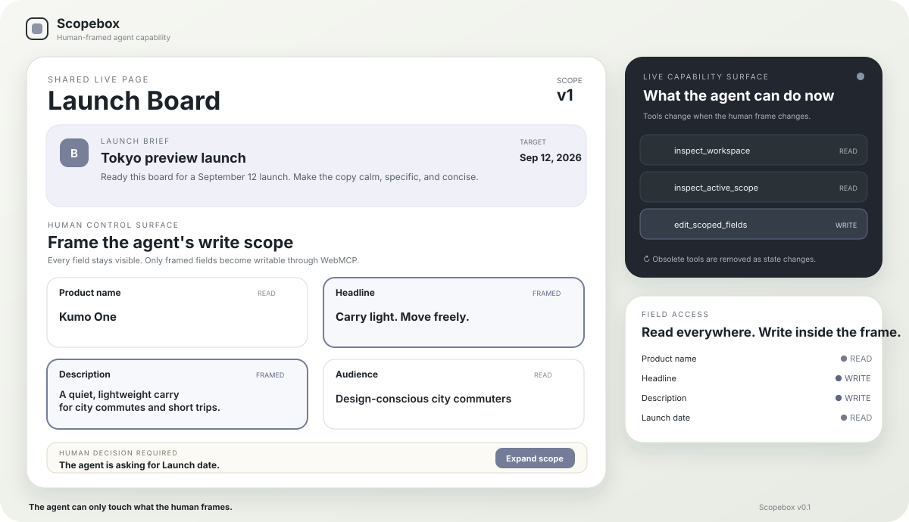

# Scopebox

**The agent can only touch what the human frames.**

Scopebox is a small WebMCP prototype for human-framed agent capability. A person selects the exact fields an agent may edit on a shared live page. The page then exposes a matching WebMCP tool surface. When the agent needs another field, it can request a wider scope, but only the human can grant it.

The demo uses a six-field product launch board. It is intentionally narrow so the central interaction stays visible.



## Why this needs WebMCP

Scopebox does not merely check permissions after a tool call. It changes which tools are available as the page state changes.

- No fields framed: read tools only.
- Headline and description framed: `edit_scoped_fields` is registered with only those two properties.
- Agent requests the launch date: a visible human decision appears, but permissions do not change.
- Human approves: scope version increments and the edit tool is re-registered with the new field.
- Changes exist: `submit_changes_for_review` becomes available.
- Human accepts the review: write tools disappear.

Each dynamic write tool closes over the scope version that issued it. A stale invocation fails closed with `HOLD / SCOPE_STALE`.

Human review decisions close over the exact rendered `reviewId`. A decision without an identity fails closed with `HOLD / REVIEW_ID_REQUIRED`; a decision aimed at an older change set fails closed with `HOLD / REVIEW_STALE`. Neither condition mutates the board.

```text
scopeVersion = which capability boundary the agent acted under
reviewId     = which frozen change set the human decided on
```

## Three-minute demo path

1. Human frames **Headline** and **Description**.
2. Ask the agent:

   > Prepare this board for the September 12 launch. Improve the copy, fix anything that blocks the brief, and submit the result for my review. Do not change the audience or price.

3. Agent inspects the workspace and active scope.
4. Agent edits only the framed copy fields.
5. Agent notices that the board says September 18 and requests **Launch date**.
6. Human approves the visible scope request.
7. The page reissues the write capability under a new scope version.
8. Agent changes the launch date to September 12 and submits the change set.
9. Human reviews the diff and accepts it.

## Tool surface

| Tool | Availability | Effect |
| --- | --- | --- |
| `inspect_workspace` | Always | Reads brief, fields, scope, pending request, and diff. |
| `inspect_active_scope` | Always | Reads scope version, writable fields, and read-only fields. |
| `edit_scoped_fields` | Draft with at least one framed field | Atomically edits only fields in the current human scope. |
| `request_scope_expansion` | Draft with blocked fields and no pending request | Creates a human-visible request. It does not grant permission. |
| `submit_changes_for_review` | Draft with changes and no pending request | Freezes the current diff for human review. It does not accept or publish. |

## Run locally

Requirements: Node.js 20 or newer. No package installation is required.

```bash
npm run dev
```

Open:

```text
http://127.0.0.1:4173
```

A local tool simulator is available for deterministic UI testing:

```text
http://127.0.0.1:4173/?debug=1
```

The simulator invokes the same tool handlers as WebMCP. It is hidden in the normal app.

## Test

```bash
npm run check
```

The tests cover:

- versioned human scope creation
- atomic scoped edits
- all-or-nothing rejection of mixed in-scope and out-of-scope updates
- stale capability failure after a human scope change
- agent request versus human grant separation
- review submission versus human acceptance separation
- exact `reviewId` binding for Human acceptance
- fail-closed handling for missing and stale review identities

## Test with WebMCP

### ChatGPT built-in browser

Open the deployed page in the ChatGPT desktop app's built-in browser and inspect **Site tools** in the address bar. Use GPT-5.6 Sol or Terra.

### Chrome local development

1. Open `chrome://flags/#enable-webmcp-testing`.
2. Enable the flag.
3. Relaunch Chrome.
4. Open the local Scopebox page.
5. Use the Model Context Tool Inspector extension or another compatible agent to inspect and call the tools.

The app uses JavaScript tool registration in the top-level page. It does not rely on the declarative API or iframe discovery.

## Architecture

```text
Human UI
  | selects fields / approves requests / decides an exact rendered review
  v
Versioned domain state
  | derives currently valid capabilities and frozen review identity
  v
WebMCP registration manager
  | aborts obsolete registrations and registers current tools
  v
Agent tool calls
  | strict code validation, atomic changes, visible UI updates
  v
Shared activity history
```

The app is static and local-first. State is stored in `localStorage` for the current browser. There is no account system, backend, external API, analytics, or hidden agent authority.

## Project boundaries

Scopebox v0.1 is not a general workflow builder, deployment platform, or enterprise permission system. It demonstrates one relationship clearly:

> Human-selected page scope becomes the agent's live write capability.

See [`docs/BUILD_BRIEF.md`](docs/BUILD_BRIEF.md) for the fixed product contract, [`docs/DEMO_SCRIPT.md`](docs/DEMO_SCRIPT.md) for the recording plan, and [`docs/VALIDATION.md`](docs/VALIDATION.md) for the current test record.

## References

- OpenAI Site tools documentation: <https://learn.chatgpt.com/docs/webmcp>
- Chrome WebMCP Imperative API: <https://developer.chrome.com/docs/ai/webmcp/imperative-api>
- Chrome WebMCP best practices: <https://developer.chrome.com/docs/ai/webmcp/best-practices>
- WebMCP tool security guidance: <https://developer.chrome.com/docs/ai/webmcp/secure-tools>

## License

MIT
